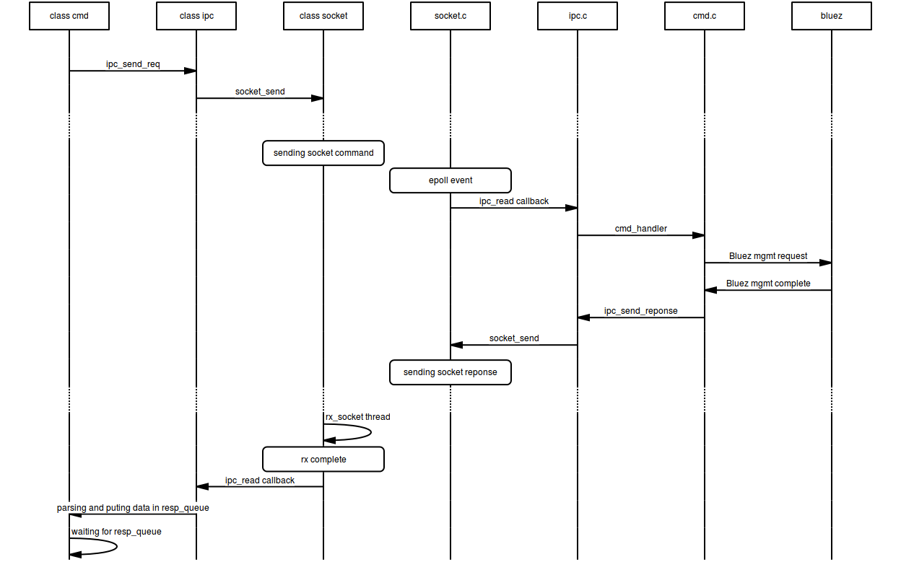

# Bluetooth Low Energy Daemon - btled

## Motivation

The origin of the btled server/client application come from a personnal desire to gathers 
into one interface most of powerful capabilities offers by Linux bluetooth stack.

In fact Bluez exposed many useful tools like btmgmt, btmon, btgatt-client, btattach, but while developing, verifying or testing BLE firmware, we have to jump from a binary to an other one.

Fortunately, exists two majors python script with similar requierements:

* pyGatt is a awesome mulitplatform (Linux and Windows) scripts.
However, as pyGatt is based on the deprecated gatttool, it does not offers mgmt capacity like setting local name, connection parameters for instance.
* Bluepy is another tools communicating (through stdin, stdout) with its corresponding bluepy-helper binary to handle Bluez management interface.
However, the main drawback is that Bluepy is launching as many bluepy-helper binary as BT interface you want to work with.

However both of them are deprecated as they are using hci socket interface instead of the new D-Bus Gatt API.

## Design

Btled component is inspired by a whole open source project, but is written focusing on speed, simplicity, and flexibility.


### Build

```shell
make -C src
```

### Installation

```shell
sudo apt-get install ./dpk/btled_1.0_all.deb
```

### Example

```shell
# launching Bluetooth Low Energy daemon
$ sudo /etc/init.d/btled --start
09:39:55 main [I] Starting Bluetooth Low Energy daemon
```

```shell
# running scan.py example
$ sudo python ./example/scan.py
reading controller information
response status [ok]
{'status': 'ok', 'result': {'supported_settings': 49151, 'addr': '00:1a:7d:da:71:11', 'name': 'Latitude-E5470', 'version': 6, 'dev_class': 0, 'current_settings': 2576, 'manufacturer': 10}}
addr: 00:1a:7d:da:71:11
version:6
manufacturer:10
supported settings = 0xBFFF
currentsettings settings = 0x0A10
devclass = 0x0000
name Latitude-E5470
powering on
response status [ok]
scan start
new event
response status [ok]
new event
addr: f4:f5:d8:67:cd:f5 rssi:-88 
new event
addr: f4:f5:d8:67:cd:f5 rssi:-86 
new event
addr: f4:f5:d8:67:cd:f5 rssi:-91 
new event
addr: f4:f5:d8:67:cd:f5 rssi:-86 
new event
addr: f4:f5:d8:67:cd:f5 rssi:-87 
scan stop
new event
response status [ok]
powering off
response status [ok]

```

```shell
# running central.py example
$ sudo python ./example/central.py -c hci0 -a "00:11:22:33:44:55"
connected with 00:11:22:33:44:55
service discovery:
service: 0000180a-0000-1000-8000-00805f9b34fb
start: 1
end: 13
        characteristics: 00002a24-0000-1000-8000-00805f9b34fb
        handle: 2
        value_handle:  3
        properties: 02
        ext prop: 0000
        characteristics: 00002a25-0000-1000-8000-00805f9b34fb
        handle: 4
        value_handle:  5
        properties: 02
        ext prop: 0000
        characteristics: 00002a26-0000-1000-8000-00805f9b34fb
        handle: 6
        value_handle:  7
        properties: 02
        ext prop: 0000
        characteristics: 00002a27-0000-1000-8000-00805f9b34fb
        handle: 8
        value_handle:  9
        properties: 02
        ext prop: 0000
        characteristics: 00002a28-0000-1000-8000-00805f9b34fb
        handle: 10
        value_handle:  11
        properties: 02
        ext prop: 0000
        characteristics: 00002a29-0000-1000-8000-00805f9b34fb
        handle: 12
        value_handle:  13
        properties: 02
        ext prop: 0000
service: 0000180d-0000-1000-8000-00805f9b34fb
start: 14
end: 18
        characteristics: 00002a37-0000-1000-8000-00805f9b34fb
        handle: 15
        value_handle:  16
        properties: 02
        ext prop: 0000
        characteristics: 00002a39-0000-1000-8000-00805f9b34fb
        handle: 17
        value_handle:  18
        properties: 02
        ext prop: 0000
service: 0000180f-0000-1000-8000-00805f9b34fb
start: 19
end: 23
        characteristics: 00002a19-0000-1000-8000-00805f9b34fb
        handle: 21
        value_handle:  22
        properties: 02
        ext prop: 0000
service: de305d54-75b4-431b-adb2-eb6b9e546015
start: 24
end: 27
        characteristics: de305d54-75b4-431b-adb2-eb6b9e546016
        handle: 25
        value_handle:  26
        properties: 3a
        ext prop: 0000

```

### Running the test

```shell
# launching Bluetooth Low Energy daemon
sudo /etc/init.d/btled --start
```

```shell
# running loopback test
sudo python ./test/ipc_loopback.py
```
## Coding style
[Linux kernel coding sytle](https://www.kernel.org/doc/html/v4.10/process/coding-style.html).

## License

GPL-3.0 - <https://opensource.org/licenses/GPL-3.0>

## Author
Jonathan Gelie <[contact@jonathangelie.com](mailto:contact@jonathangelie.com)>
