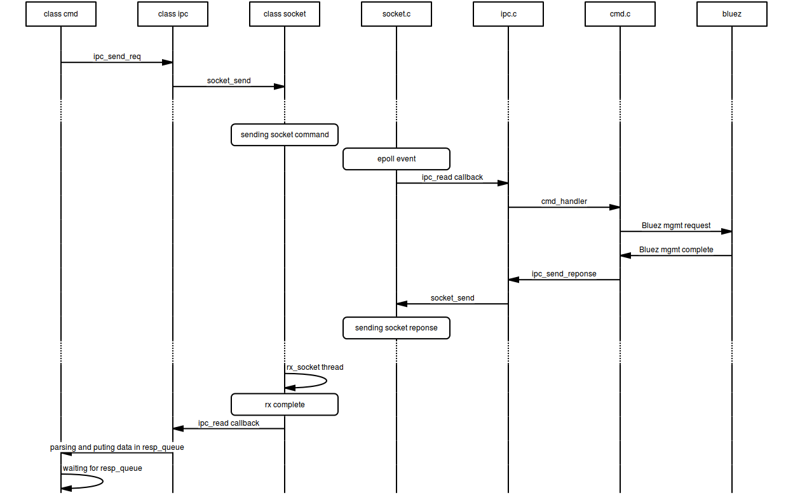

************* 
Bluetooth Low Energy Daemon - btled
*************

Motivation
*****************
 
The origin of the btled server/client application comes from a personnal desire to gathers 
into one interface most of powerful features offers by Bluez stack.

Bled is based on the new D-bus GATT API.

Design
***************** 

Btled component is inspired by a whole open source project, but is written focusing on speed, simplicity, and flexibility.

Installation
*****************

Build
-----------------

.. code:: bash

    make -C src

Install
-----------------

.. code:: python

    sudo apt-get install ./dpk/btled_1.0_all.deb